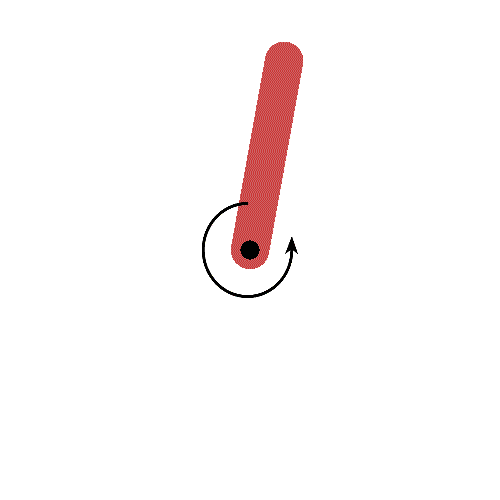

### C. Classical Control
The goal of this assignment is to familiarize you with basics of classical
control. You will be deriving the equations for a discrete time linear
quadratic regulator, and using it to solve a linear system, and stabalizing a
non-linear system about an unstable fixed point.

1. **Deriving LQR Equations. [15pts]** Consider a linear system with state `x`, and
   controls `u` that evolves as per `x[t+1] = Ax[t] + Bu[t]`. We want to obtain
   control values `u[t]` that optimize the sum over a time horizon of `T`, of
   the following cost function: `x[t]'Qx[t] + u[t]'Ru[t]`. The total cost to go
   when acting optimally at any time-step `t` is a quadratic function of the
   state at that time: `x[t]'P[t]x[t]`. Derive equations that can be used to
   obtain `P[t]`, and the corresponding optimal control `u[t]`.
2. **Controlling a linear system.** We will now use the equations that you
   derived above to control a linear system. Consider a point mass in 1D, for
   which we can control the acceleration. The state of this system can be
   described by a position `x` and velocity `v`. In discrete time, on
   application of control `u`, the system evolves as follows (for a fixed
   simulation time step `dt`):
   ```
   x[t+1] = x[t] + v[t]*dt
   v[t+1] = v[t] + u[t]*dt
   ```
   1. **[5pts]** Write down the `A` and `B` matrices for this linear system?
   2. We want to control the acceleration for this point mass to
   bring it at rest at the origin. We will do so, by minimizing the sum over
   time of the following cost function: `x[t]^2 + v[t]^2 + u[t]^2`. Solve for a
   controller that brings the point mass to origin, by minimizing this cost
   function. We have provided starter code that implements the environment, you
   need to write a controller class which implements a `act` function that
   outputs the control value (you can start from `DummyController`). 
      - You can run you controller in this environment by calling `python
        run_classical_control.py --env_name DoubleIntegrator-v1 --num_episodes
        1`.
      - By passing in a `--vis` flag you can visualize what your controller is
        doing: calling `python run_classical_control.py --env_name
        DoubleIntegrator-v1 --num_episodes 1 --vis`. Here is the visualization
        of the controller that I wrote: 
      
      1. **[5pts]** Report the control matrix and cost to go matrix for this
      system as obtained by your implementation of LQR, for `t=0`.
      2. **[5pts]** We will measure the average cost incurred by your
      controller, and success rate (success defined as whether the point mass
      was in goal configuration at the end of the episode). You should report
      the total average cost, and success rate of your controller over 100
      episodes.  `python run_classical_control.py --env_name
      DoubleIntegrator-v1 --num_episodes 100`. 
3. **Stabalizing an inverted pendulum.** Next, we will stabalize a
   non-linear system about an unstable fixed point. We will work with an
   undamped pendulum of unit length, unit mass on a planet with `g=10`.
   Dynamics for a pendulum are governed using the equations
   [here](envs/pendulum.py#L57). Note the choice of the coordinate frame. <br/>
   
   
   Our goal is to stabalize this pendulum in an inverted position (`theta = 0`
   and `theta dot = 0`).  
   We will linearize it about the inverted position, and obtain controllers
   that stabalize this linearized system.

   1. **[5pts]** Linearize the system about the point `theta = 0` and `thetadot
   = 0`.  Show your work, and report the linearized system.
   2. **[5pts]** Use the linear-quadratic regulator controller from the
   previous parts, and obtain a controller to stabalize the pendulum. You can
   run the controller in this environment with `python run_classical_control.py
   --env_name PendulumBalance-v1 --num_episodes 1`.  You can also use the
   `--vis` flag as above. Report the average cost, and total number of frames
   that the pendulum is upright (`abs(th) < 0.1`) over 100 episodes. <br/>
   .
   3. **[5pts]** Next, we will study how robust is your controller to noise in
   the dynamics. We will add zero-mean Gaussian noise (with varying standard
   deviation) to the dynamics updates (see [here](envs/pendulum.py#L69)). We
   will measure the total time spent by the pendulum in the upright position.
   You can invoke this noisy environments using: `python
   run_classical_control.py --env_name PendulumBalance-v1 --num_episodes 100
   --pendulum_noise 0.1`, where `0.1` is the standard deviation of the additive
   Gaussian noise. Plot the average cost, and the average time spent by the
   pendulum in the upright position as a function of the standard deviation of
   the noise for your controller. As above use 100 episodes per standard
   deviation value.  Vary the standard deviation between `0` and `0.1` in steps
   of `0.01`.
